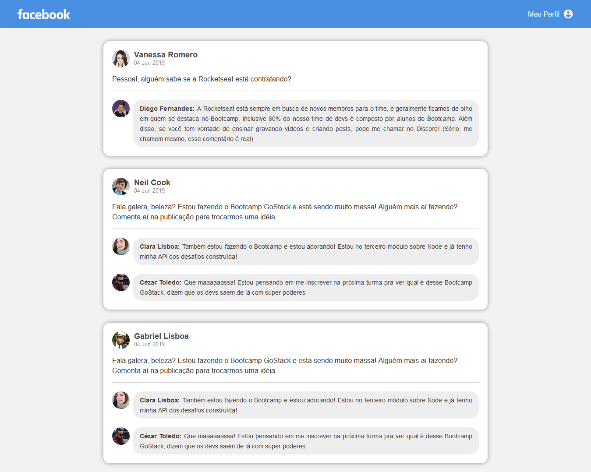

<h1 align="center">
ReactBook
</h1>

<br/>

<h2 align="center">Site</h2>
<h3 align="center">

</h3>
<br/>

<h3 align="center">
Site que imita o layout de comentario do facebook, utlizando ReactJS
</h3>

## Instalação
Clone este repositório e instale as dependências
```sh
git clone https://github.com/rafaelsouz/react-book.git
cd react-book
yarn
# ou
npm install
```
### Rodar aplicação
```
yarn dev
```
> Lembre-se de deixar rodando e acesse localhost:8080 para visualizar o resultado...

Utilizei as seguintes tecnologias:

-  [Node.js](https://nodejs.org/en/)
-  [webpack](https://webpack.js.org/)
-  [css-loader](https://github.com/webpack-contrib/css-loader)
-  [file-loader](https://github.com/webpack-contrib/file-loader)
-  [style-loader](https://github.com/webpack-contrib/style-loader)
-  [React](https://pt-br.reactjs.org/)
-  [VS Code](https://code.visualstudio.com/)

---

Made with ♥ by Rafael Souza :wave: [linkedin](https://www.linkedin.com/in/rafaelsouz/)